# OpenCV_Lego_Detection_and_Counting

## Table of Contents
* [Introduction](#Introduction)
* [Objective](#Objective)
* [Graphical User Interface](#Graphical-User-Interface)
* [Computer vision approach](#Computer-vision-approach)
* [Contrain](#Contrain)
* [Result and discussions](#Result-and-discussions)
* [Conclusion](#Conclusion) 

## Introduction

In machine vision system, a camara is used to capture the image and the computer is used to process, analyse and measure various characteristics for decision making. In this assignment, a machine vision system is to be designed for detection and sorting of Lego Bricks. The characteristic to differentiate the Legos which are used in this design are colour and number of circles in each Lego. For colour detection, thresholding operation using inRange is used. The Legos will be detected base on the range of pixel values in the HSV colour space. The hue (H) channelwhich models the colour type can be very useful in image processing task that need to segment object base on its colour (opencv, n.d.). For Saturation (S) channel, shades of grey represent unsaturated and no white component represent fully saturated (opencv, n.d.). Value (V) channel represent the brightness or the intensity of the colour. Compared to RGB, HSV is easier to segment an object in the image based on its colour (opencv, n.d.). 
<br/>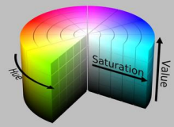
<br/>For circle detection, Hough Transform is used to find circles in an image. OpenCV uses Hough Gradient Method which uses the gradient information of edges (opencv, n.d.).
<br/>

## Objective
This report will be discussing about the program designed for detection and sorting of Lego Bricks. It will be explaining the GUI, the computer vision approach taken to identify the type of Lego and number of Legos. Furthermore, the different constraints will also be discussed. Lastly, the result of the output video will be analysed. 

## Graphical-User-Interface
The following image shows the GUI of the program. 
<br/>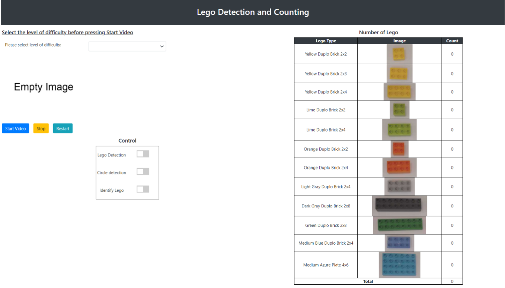
<br/>The following are the steps on detecting and counting Lego using the GUI above.
1. Select the video level of difficulty from the drop-down option
<br/>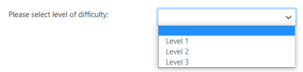 
2. Click on Start Video button to start Lego detection
<br/>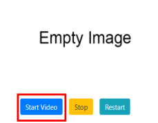 
3. Click on Stop button to pause video and Restart button to continue the video
<br/>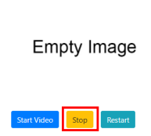 
4. The toggle buttons in the control can do the following:
  <br/>a. Lego Detection toggle button allow the contour and centre point to be drawn on the output video
  <br/>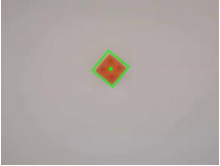 
  <br/>b. Circle Detection toggle button allow the circle and the centre point of circle to be drawn on the output video
  <br/>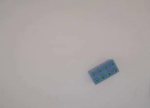 
  <br/>c. Identify Lego toggle button will label the type of Lego in the output video
  <br/>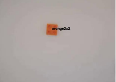 
5. The table will display the number of Lego detected for each type of Lego and the total 
number of Lego detected in each frame. The badge will alert the user of the Lego 
detected.
<br/>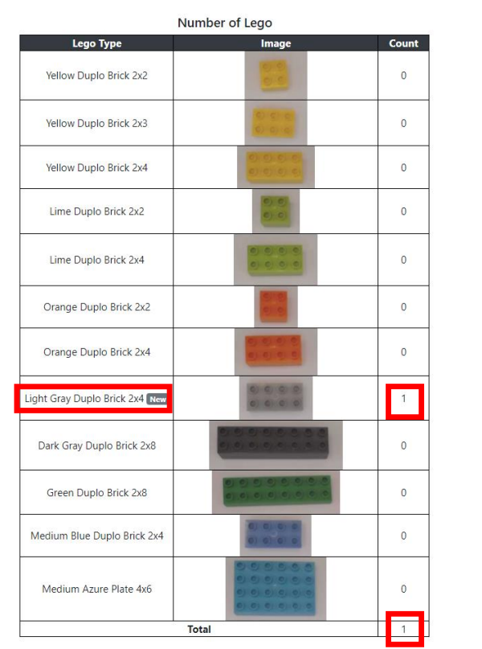 
6. When video ended it will be shown beside the drop-down option. Another video level 
of difficulty can be selected from the drop-down option after the video playing have 
stopped.
<br/>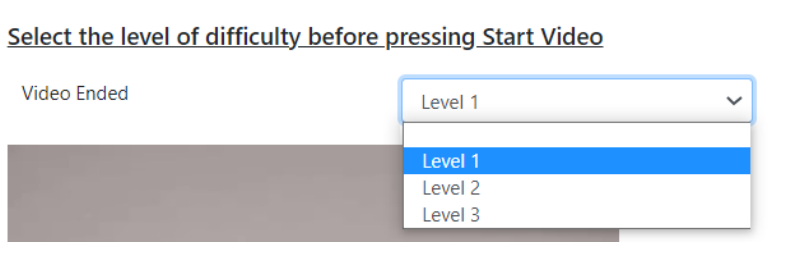 

## Computer-vision-approach
### Before detection and counting
Initially, the user is asked to select the video base on it level of difficulty for detection and counting. The empty.png image is being displayed in the beginning.
```
# Read Images
img = cv2.imread("./web/image/empty.png",cv2.IMREAD_GRAYSCALE)

# Setup the images to display in html file
@eel.expose
def setup():
   text_send_to_js("Select the level of difficulty before pressing Start Video ", "p1")
   img_send_to_js(img, "output")
```
### Start of detection and counting 
After user have press on the Start Video button, function video_feed() will be executed. In the function, eel.get_Option()() is used to get the level of difficulty of video to determine the video_name which will be used. If user did not pick an option, they will be prompt to select again.
```
def video_feed():
  global x
  option= eel.get_Option()()
  if option == 'Level 1':
    video_name = "./web/image/brick1_02.mp4"
  elif option == 'Level 2':
    video_name = "./web/image/brick3_10.mp4"
  elif option == 'Level 3':
    video_name = "./web/image/brick6_14.mp4"
  else:
    text_send_to_js("Select the level of difficulty before pressing Start Video", "p1")
```


After video_name is determined, it is pass through VideoCamera() and process() to output the processed video. Next, each frame of the processed video is output as image using a for loop. To ensure that not more than one video is processing at the same time, the video will end 2 frames before the end of the video.
```
if option == 'Level 1' or option == 'Level 2' or option == 'Level 3':
    x = VideoCamera(video_name)
    y = process(x)
    text_send_to_js("Wait until the end of video before selecting the next video", "p2")
    #stop early
    z=cv2.VideoCapture(video_name)
    nFrames = int(z.get(cv2.CAP_PROP_FRAME_COUNT))
    a=0
    for frame in y:
      #    frame = cv2.cvtColor(frame, cv2.COLOR_BGR2GRAY)
      img_send_to_js(frame, "output")
      a=a+1
      if a==(nFrames-2):
        break
    text_send_to_js("Video Ended", "p2")
```

### Processing
In the process function, it is where each Lego in each frame is being identified and counted.cntFrame is a counter to only update the number of Lego in every other 25 frames. Thus, cntFrame is initialised as 24 and increase by 1 for every frame. Next, camera.get_frame() is used to get each frame.
```
def process(camera):
  cntFrame=24
  while True:
      cntFrame=cntFrame+1
      success, frame = camera.get_frame()
```
Dictionary lego_val and badge_update_dict are used to store the Lego count and badge before they are updated in the GUI.
```
lego_val = {
        "yellow2x2":0,
         "yellow2x3":0, 
         "yellow2x4":0,
         "lime2x2":0,
         "lime2x4":0,
         "orange2x2":0,
         "orange2x4":0,
         "mediumblue2x4":0,
         "mediumazure4x6":0, 
         "lightgray2x4":0,
         "grey2x8":0,
         "green2x8":0,
         "total":0}
      badge_update_dict={
        "yellow2x2badge":"",
         "yellow2x3badge":"", 
         "yellow2x4badge":"",
         "lime2x2badge":"",
         "lime2x4badge":"",
         "orange2x2badge":"",
         "orange2x4badge":"",
         "mediumblue2x4badge":"",
         "mediumazure4x6badge":"", 
         "lightgray2x4badge":"",
         "grey2x8badge":"",
         "green2x8badge":"",}
```

### Determine Color
To determine the colour, each frame will be pre-processed using GaussianBlur() to remove noise and converted to HSV colour (pastebin, 2016).
```
 blurred = cv2.GaussianBlur(frame, (11, 11), 0)
 hsv = cv2.cvtColor(blurred, cv2.COLOR_BGR2HSV)
```
<br/>

A mask is being created using inRange() for every colour (pastebin, 2016). The parameter for the upper and lower limit of the HSV for each colour is being determined using trackbar and declared in upper and lower dictionary. 
```
for key, value in upper.items():
          kernel = np.ones((9,9),np.uint8)
          mask = cv2.inRange(hsv, lower[key], upper[key])
```
```
lower={'Yellow':(14,90,0),'Orange':(4,49,160),'Mediumazure':(84,58,77),'Lime':(9,72,104),'Lightgray':(0,0,83),'Grey':(0,0,44),'Green':(51,39,65),'Mediumblue':(102,53,70)}

upper={'Yellow':(28,255,255),'Orange':(12,206,196),'Mediumazure':(104,215,198),'Lime':(37,162,152),'Lightgray':(209,40,140),'Grey':(192,39,83),'Green':(69,127,146),'Mediumblue':(137,162,152)}
```
<br/>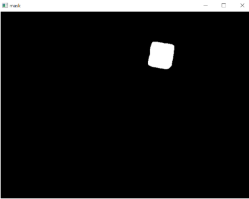
<br/>If the mask is black it means that the colour being check is not present and will move on to check for the next colour (ebeneditos, 2017). 
```
if cv2.countNonZero(mask) == 0:
        continue
```
### Contour Detection 
Before detecting the contour, morphological process such as opening and closing is applied to remove noise in the mask (pastebin, 2016). The contours in the mask are being detected using findContours() (pastebin, 2016).
```
mask = cv2.morphologyEx(mask, cv2.MORPH_OPEN, kernel)
mask = cv2.morphologyEx(mask, cv2.MORPH_CLOSE, kernel)
contours = cv2.findContours(mask.copy(), cv2.RETR_EXTERNAL,cv2.CHAIN_APPROX_SIMPLE)[-2]
center = None
```
### Circle Detection
Before detecting the circle, the frame is converted to grayscale and blur() is being applied to remove noise. The mask is used to mask the frame using bitwise_and() to only show the Lego with the colour which is being checked.
```
gray = cv2.cvtColor(frame, cv2.COLOR_BGR2GRAY) 
gray_blurred = cv2.blur(gray, (3, 3))
mask_lego = cv2.bitwise_and(gray_blurred, gray_blurred, mask=mask) 
```
<br/>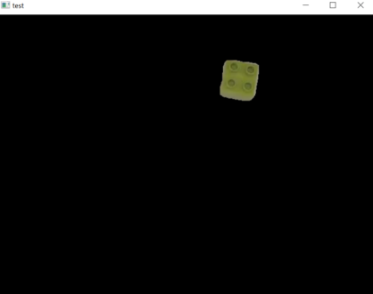
<br/>The circles are then being detected using HoughCircles() (opencv, n.d.). The parameter param1, param2, minRadius and maxRadius are optimised to detect the circle using trackbar. Next, the program will check if circle is detected before moving on.

```
detected_circles = cv2.HoughCircles(mask_lego,cv2.HOUGH_GRADIENT, 1, 20, param1 = 19, param2 =12, minRadius = 5, maxRadius = 10)
if detected_circles is not None: 
    # Convert the circle parameters a, b and r to integers. 
    detected_circles = np.uint16(np.around(detected_circles))
```

### Drawing contour
For every contour detected, only contour with area more than 2500 will be processed. This is to remove false positive Lego being detected. Next, using minAreaRect() a rotated rectangle bounding box and centre of Lego can be drawn if the Lego Detection toggle button is true (opencv, n.d.).
```
for i in range(len(contours)):
              area = cv2.contourArea(contours[i])
              if (area>2500):
                M = cv2.moments(contours[i])
                center = (int(M["m10"] / M["m00"]), int(M["m01"] / M["m00"]))
                rect = cv2.minAreaRect(contours[i])
                box = cv2.boxPoints(rect)
                box = np.int0(box)
                contour= eel.contour()()
                if contour==True:
                  cv2.drawContours(frame,[box],0,(0,255,0),2)
                  cv2.circle(frame,center, 5, (0, 255, 0), -1)
```

### Determine size of Lego 
numcircle is a variable to count the number of circles in a contour. For each circle detected, it is checked if it is in the contour using pointPolygonTest() (opencv, n.d.). When dist is true, numcircle will increase by 1. When circle detection toggle button is true, the circle and the midpoint of the circles will be drawn in the frame. 
```
numcircle=0
                for pt in detected_circles[0, :]:
                  a, b, r = pt[0], pt[1], pt[2]
                  dist=cv2.pointPolygonTest(contours[i],(a, b),False)
                  if dist==1:
                    numcircle=numcircle+1
                  circle= eel.circle()()
                  if circle==True:
                    cv2.circle(frame, (a, b), r, (0, 255, 0), 1) 
                    cv2.circle(frame, (a, b), 1, (0, 0, 255), 1)
```
### Counting
In the end, numcircle will be the number of circles detected in that Lego and key is the colour of the Lego. legotype() function is used to determine the type of Lego base on the colour and number of circles. When Identify Lego toggle button is true, the label of the Lego is output on the frame. 
```
#determine type of lego base on number of circle
                text=legotype(numcircle,key)
                badge=text+"badge"
                #text=str(numcircle) +" "+ key + " lego"
                label= eel.label()()
                if label==True:
                  cv2.putText(frame,str(text), center, cv2.FONT_HERSHEY_SIMPLEX, 0.6,(0,0,0),2)
```
The display of the Lego count is only updated every other 25 frames to ensure the number of Lego counted does not fluctuate. The count and badge are updated in lego_val and badge_update_dict.
```
if cntFrame%25 == 0:
                  lego_val[text]=lego_val[text]+1
                  badge_update_dict[badge]="New"
                  lego_val["total"]=lego_val["total"]+1
                  lego_val_send_to_js(lego_val)
                  badge_update(badge_update_dict)

      yield frame
```
Functions lego_val_send_to_js() and badge_update() are used to update the table in the GUI.
```
def lego_val_send_to_js(lego_val):
  for key, value in lego_val.items():
    text_send_to_js(str(value), key)

def badge_update(badge_update_dict):
  for key, value in badge_update_dict.items():
    text_send_to_js(str(value), key)
```
## Contrain
The light intensity of light source and orientation of Lego are two main constrains when using this program to detect and count the Legos. 

### Light intensity of the light source
The light intensity needs to be consistent in all video. This is because colour detection is done using inRange() where colour is found when HSV fall between the upper and lower limit of the colour. The upper and lower limit of the colour is initialized base on the sample video. If the light source is very bright, the Lego which has a smooth surface can reflect light. This will create a bright spot in the Lego which cause the colour to fall outside the HSV limit. If the light source is too dark, the colour will also fall outside the HSV limit. 

### Orientation of Lego 
The Lego need to be facing up where the Lego studs are facing the camera. This is because the size of the Lego is determined based on the number of circles detected. If the Lego is rotated in any other orientation where the studs cannot be seen, the Lego will not be detected. 

## Result-and-discussions
After testing the program with the sample videos, the program can determine the colour of the Lego with high accuracy. This is done by constantly optimising the HSV range for each colour. This is because the range cannot be too short where part of the Lego is not detected or too large where more than one colour is detected. The program can detect Lego with lesser false positives. This is done by adding a minimum area of the contour to be considered as a Lego. This is because sometimes shadow cast by Lego is wrongly detected as a light grey Lego. False-positive detection is also reduced through pre-processing image and morphological process. The program can detect the number of circles accurately most of the time. There are only a few instances where the number of circles is higher or lower by 1. To ensure that the type of Lego is determined correctly, the number of circles detected is only used to determine the size of yellow, orange and lime Lego. The size of the Lego is also determined based on a range of numbers of circles detected to allow tolerance. However, sometimes the size of yellow Lego change between 2x2 and 2x3. This might be improved by further optimizing the parameter in HoughCircles() or pre-process image with medianblur() instead of blur() before detection.

## Conclusion
Through this project, I have explored many features which I have never used before while incorporating the knowledge which I have learnt. For GUI, I learnt to use toggle buttons where I also had to code JavaScript for the first time. I also learnt to use CSS to style the element such as colour and centralising. I explored the elements in bootstrap and use the badge feature which helps to alert the user about which Lego is detected. For the computer vision approach, I learnt to search and use function base onthe application. I had to experiment with trackbar to find the parameter for the functions. I also had to consider ways to reduce false positive detection. The programme could be improved by updating the count when there is a change in the frame instead of every 25 frames. This can help to reduce the delay in updating the frame when there is a change in frame. All in all, the program can detect and count the Lego well.

